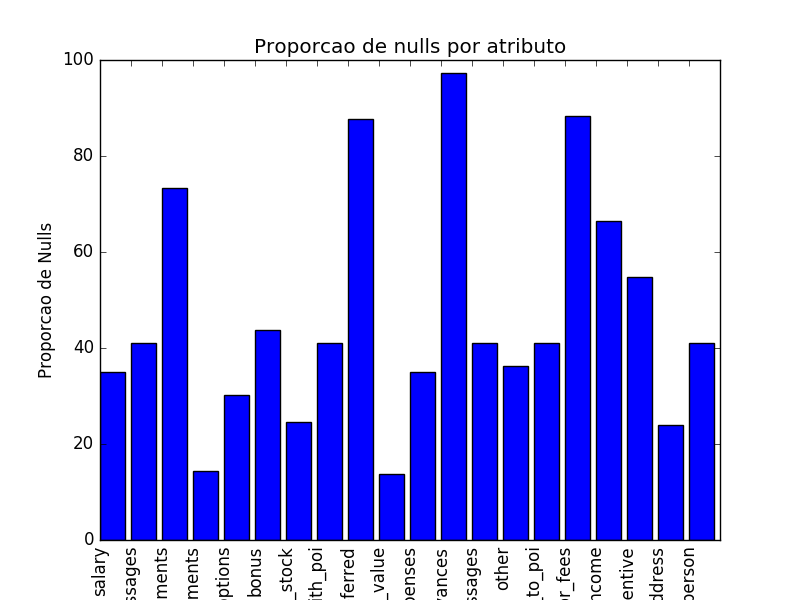
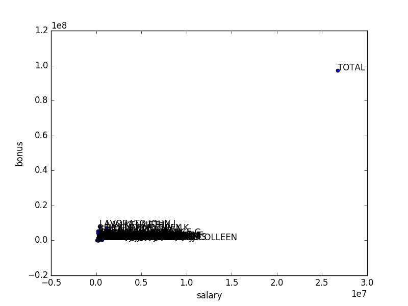

# Identificando fraudes com os emails de Enron

## Resumo

O objetivo desse projeto é criar um modelo para indetificar pessoas de interesse baseado no dataset de emails da Enron. 
Os dados incluem 146 registros de email e financeiros de diferentes indivíduos.
Os dados também incluem o atributo "poi" para esses indivíduos. Existem 18 pessoas marcadas como POI e 128 não-POIs. Há um total de 21 atributos, 6 atributos de e-mail, 14 atributos financeiros e a label poi.

- Alguns atributos na base de dados possuem mais de 70% de dados Nulls
    
- Outlier com valores de salary e bonus altos : TOTAL
    
- Indivíduo com todos os atributos fincanceiros NaN: 'LOCKHART EUGENE E'
 
Para identificar os outliers foi utilizado técnicas de vizualização e verificação da base. 
Essas anomalias foram retiradas do dataset, os atributos que possuiam em sua maior parte NaN foram retirados, pois poderiam influenciar no treinamento do modelo. 

## Atributos

Os atributos retirados do dataset que possuiam mais de 70% dos registros como null:
- `'deferral_payments'`
- `'restricted_stock_deferred'`
- `'loan_advances'`
- `'director_fees'`

Atributo retirado pois representava múltiplos tipos pagamentos: 
- `'other'`

Os atributos restantes descritos abaixo, serão testados para selecionar o melhor conjunto. 

| Atributos Financeiros | Atributos dos emails | Label |
| ---------------------- | ---- |----|
|  salary  | to_messages | poi
|  total_payment  |  from_poi_to_this_person |
|  bonus  |   from_messages| 
|  deferred_income |  from_this_person_to_poi 
|  total_stock_value | shared_receipt_with_poi
|  expenses |
|  exercised_stock_options |
|  long_term_incentive |
|  restricted_stock |


Foram criados dois atributos relacionados com os emails enviados para pessoas de interesse (POI):
- `'fraction_to_poi'`
- `'fraction_from_poi'`


Já que os atributos selecionados possuem diferentes unidades, os atributos foram escalados utilizando a função MinMaxScaler.

```python
data = featureFormat(my_dataset, features_list, sort_keys = True)
labels, features = targetFeatureSplit(data)

scaler = MinMaxScaler()
features = scaler.fit_transform(features)
``` 
Para selecionar o melhor conjunto foi utilizado a função SelectKBest que rankea as features. Após testar um conjunto de 5 features e label poi os seguintes resultados: 

`['poi', 'exercised_stock_options', 'total_stock_value', 'bonus', 'salary', 'deferred_income']`

| Algorithm |  Accuracy | Precision | Recall | f1 | Time  |
| ---------  | ----- | ----- | ----- | ----- | ----- |
|  NaiveBayes  |  0.904  | 0.33  |  0.33  |   0.33 |  0.090 | 
|  AdaBoost  |  0.952  |  1.0  |   0.33 |  0.5  |  90.06  | 
|  SVM* |0.928  |  0.0  |  0.0  |  0.0  |  4.88  | 

*Houve divisão por zero, recall e precision estão zerados pois não houve positivos verdadeiros na predição.

Após testar um conjunto de 10 features e a label poi os seguintes resultados: 
`['poi', 'exercised_stock_options', 'total_stock_value', 'bonus', 'salary', 'deferred_income', 'long_term_incentive', 're
stricted_stock', 'total_payments', 'shared_receipt_with_poi', 'expenses']`


| Algorithm |  Accuracy | Precision | Recall | f1 | Time |
| ---------  | ----- | ----- | ----- | ----- | ----- |
|  NaiveBayes  |  0.886  | 0.5  |  0.6  |   0.545 | 0.0740  | 
|  AdaBoost  |  0.8636  |  0.5  |   0.4  |  0.44  |  207.51  | 
|  SVM* | 0.8863  |  0.0  |  0.0  |  0.0  |  9.25 |

*Houve divisão por zero, recall e precision estão zerados pois não houve positivos verdadeiros na predição


Após testar o conjunto total features os seguintes resultados:

`['poi', 'exercised_stock_options', 'total_stock_value', 'bonus', 'salary', 'deferred_income', 'long_term_incentive', 're
stricted_stock', 'total_payments', 'shared_receipt_with_poi', 'expenses', 'from_poi_to_this_person', 'from_this_person_t
o_poi', 'to_messages', 'from_messages']` 

| Algorithm |  Accuracy | Precision | Recall | f1 | Time |
| ---------  | ----- | ----- | ----- | ----- | ----- |
|  NaiveBayes  |  0.90  | 0.66  |  0.4  |   0.5 |  0.031  | 
|  AdaBoost  |  0.8636  |  0.5  |   0.4  |  0.44  |  118.2  | 
|  SVM* | 0.8863  |  0.0  |  0.0  |  0.0  |  4.634  |

Para avaliar se os novos atributos possuem impacto no modelo as seguintes métricas foram avaliadas.

| Naive Bayes        |   Precison | Recall | F1| 
|-----------------------|------|-----------|---|
| Base + novas features   | 0.515 | 0.3855 | 0.44120 |
| Base sem novas features |  0.48876  | 0.38050 | 0.42789 |

Os novos atributos criados possuem impacto no desempenho do algoritmo, por isso serão utilizados


Ao final foram utilizados 5 atributos originais, 2 atributos criados e a label poi para o modelo de classificação.

## Algoritmos

Foram testados 3 algoritmos diferentes, usando a função `GridSearchCV` foi possível testar e selecionar os melhores parâmetros para cada classificador.
Foi criado um dicionário para armazenar os dados relacionados com o classificador.  

 - [NaiveBayes](http://scikit-learn.org/stable/modules/generated/sklearn.naive_bayes.GaussianNB.html)
```
    'priors'                    : [None]
```

 - [AdaBoost](http://scikit-learn.org/stable/modules/generated/sklearn.ensemble.AdaBoostClassifier.html)
```
    'n_estimators'              : [25, 50, 100],
    'algorithm'                 : ['SAMME', 'SAMME.R'],
    'learning_rate'             : [.2, .5, 1, 1.4, 2.],
    'random_state'              : [42]
```
- [SVM](http://scikit-learn.org/stable/modules/generated/sklearn.svm.SVC.html)
```
     'kernel'                   : ['poly', 'rbf', 'sigmoid'],
     'cache_size'               : [7000],
     'tol'                      : [0.0001, 0.001, 0.005, 0.05],
     'decision_function_shape'  : ['ovo', 'ovr'],
     'random_state'             : [42],
     'verbose'                  : [False],
     'C'                        : [100, 1000, 10000]
```
Baseado nas métricas abaixo podemos identificar que o algoritmo NaiveBayes possui um bom desempenho na classificação e possui uma performace de tempo. 

| Algorithm |  Accuracy | Precision | Recall | f1 | Time  |
| ---------  | ----- | ----- | ----- | ----- | ----- |
|  NaiveBayes  |  0.904  | 0.33  |  0.33  |   0.33 |  0.090 | 
|  AdaBoost  |  0.952  |  1.0  |   0.33 |  0.5  |  90.06  | 
|  SVM* |0.928  |  0.0  |  0.0  |  0.0  |  4.88  |   

SVM: Houve divisão por zero, recall e precision estão zerados pois não houve positivos verdadeiros na predição.

## Refinando parâmetros (Tunning)

Refinamento de parâmetros é um passo de Machine Learning onde tentanmos encontrar os melhores parâmetros para o modelo de classificação. Realizando o refinamento podemos melhorar o desempenho do algoritmo, mas em alguns caso podemos piorar o tempo de treinamento e tempo de predição. O refinamento pode ser realizado manualmente de forma exaustiva ou utilizando algoritmos para automatizar o processo. O algoritmo escolhido não necessita de parâmetros para classificar, no entranto uma forma de encontrar os melhores parâmetros é utilizando a função `GridSearchCV`.

Utilizando a função podemos escolher os melhores parâmetros para cada algoritmo e compara-los para realizar uma escolha:

Resultados da função GridSearchCV nos três algoritmos escolhidos para a comparação: 
```
GaussianNB(priors=None)
```
```
AdaBoostClassifier(algorithm='SAMME', base_estimator=None, learning_rate=0.2,
          n_estimators=25, random_state=42)
```
```
 SVC(C=100, cache_size=7000, class_weight=None, coef0=0.0,
  decision_function_shape='ovo', degree=3, gamma='auto', kernel='poly',
  max_iter=-1, probability=False, random_state=42, shrinking=True,
  tol=0.0001, verbose=False)
```

## Validação

Validação é o processo em que um modelo treinado é avaliado com um conjunto de dados de teste.
Um erro clássico no processo de validação não é dividir seus dados em conjuntos de dados de treinamento / teste, o que leva ao overfitting, onde o modelo de classificação se ajusta muito bem ao conjunto de dados conhecido, mas se mostra ineficaz para prever novos resultados. Para validar o modelo de classificação escolhido foi utilizado a estratégia de cross validation, onde a base de dados foi separada em teste e treinamento.

Utilizando 30% da base para testes e 70% para o treinamento.

``` python
features_train, features_test, labels_train, labels_test = train_test_split(features, labels, test_size=0.3, random_state=42) 
```


## Métricas e Desempenho

Para avaliar ao desempenho do algoritmo foram selecionada 5 métricas descritas a seguir:

- Accuracy: Percentual de instâncias classificadas corretamente
- Precision: Número de vezes que uma classe foi predita corretamente dividida pelo número de vezes que a classe foi predita.
- Recall: Número de vezes que uma classe foi predita corretamente  dividido pelo número de vezes que a classe aparece no dado de teste.
- F-measure: Medida é a média harmônica entre precisão e revocação

Abaixo segue o desempenho do modelo escolhido (Naive Bayes) testado para para os teste de tamanho 300, 600, 1000 e 2000.


- `Tamanho do teste`: 300 
    > Accuracy: 0.85381       Precision: 0.48583      Recall: 0.40000 F1: 0.43876     F2: 0.41465
- `Tamanho do teste`: 600 
    > Accuracy: 0.85619       Precision: 0.49578      Recall: 0.39167 F1: 0.43762     F2: 0.40884
- `Tamanho do teste`: 1000 
    > Accuracy: 0.86050       Precision: 0.51572      Recall: 0.38550 F1: 0.44120     F2: 0.40600
- `Tamanho do teste`: 2000 
    > Accuracy: 0.86196       Precision: 0.52273      Recall: 0.38800 F1: 0.44540     F2: 0.40909

## Referências:
- [Enron Email Dataset](https://www.cs.cmu.edu/~./enron/)
- [scikit-learn Documentation](http://scikit-learn.org/stable/documentation.html)
- [Scikit-Learn and GridSearchCV](https://www.kaggle.com/cesartrevisan/scikit-learn-and-gridsearchcv)
- [Parameter estimation using grid search with cross-validation](https://scikit-learn.org/stable/auto_examples/model_selection/plot_grid_search_digits.html)


## Arquivos
- `poi_id.py`: Projeto final
- `tester.py`: Arquivo de teste
- `feature_format.py`: Formatação de atributos
- `answers.md`: Respostas 